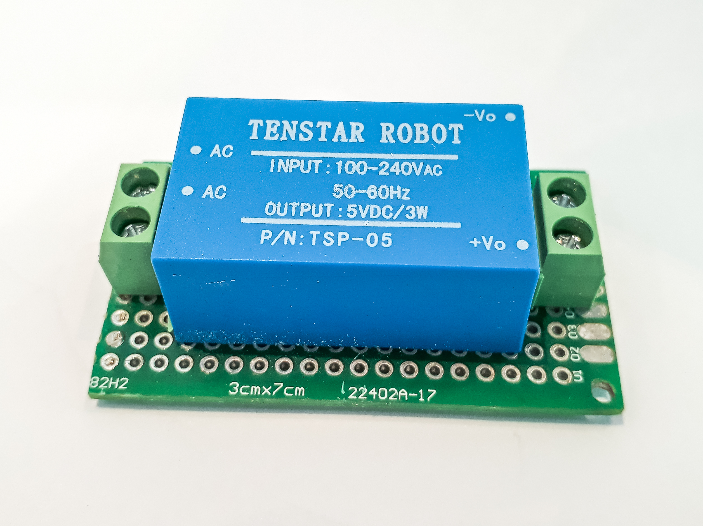
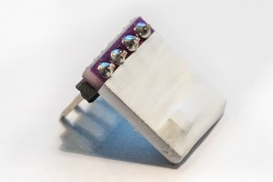
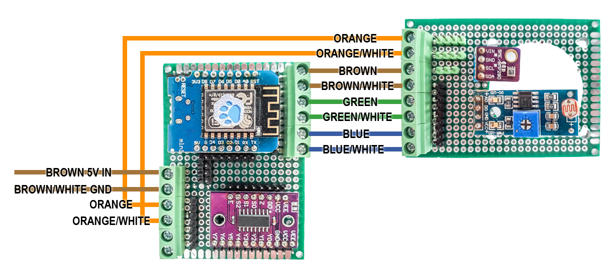
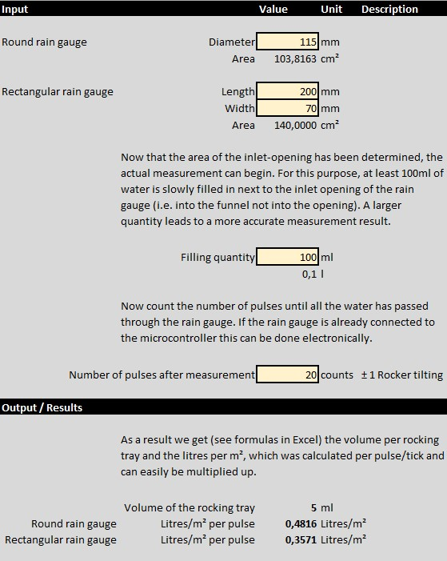
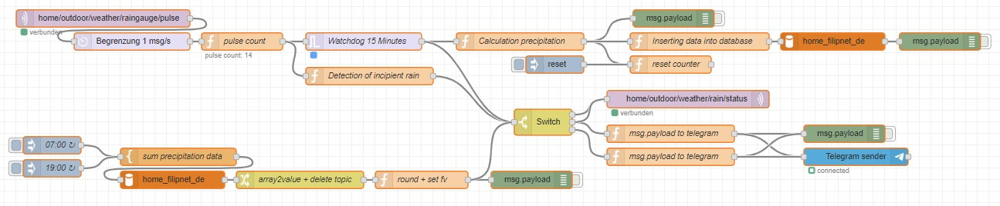

# WeatherStation

Your personal weather station with an Arduino D1 Mini MQTT and Node-RED


Proud to be part of the "Wetter.com Network" with weather station 19782. (https://netzwerk.wetter.com/wetterstation/19782/)

Further information about this project can be found on my website: https://www.filipnet.de/weatherstation/

<!-- TOC -->

- [WeatherStation](#weatherstation)
    - [FEATURES](#features)
    - [REQUIREMENTS](#requirements)
        - [ARDUINO AND SENSORS](#arduino-and-sensors)
        - [CASE FOR SENSORS](#case-for-sensors)
    - [BOARDS](#boards)
        - [BOARD FOR AC-DC TRANSFORMATOR](#board-for-ac-dc-transformator)
        - [BOARD FOR ARDUINO AND MULTILTUPLEXER](#board-for-arduino-and-multiltuplexer)
        - [BOARD FOR SENSORS](#board-for-sensors)
        - [PROTECTION OF BME280 DEPRICATED](#protection-of-bme280-depricated)
    - [INSTALL AND USAGE](#install-and-usage)
        - [PINOUT](#pinout)
        - [CONNECTION BRIDGE](#connection-bridge)
        - [LIBRARIES](#libraries)
    - [PRECIPITATION GAUGE](#precipitation-gauge)
        - [HARDWARE](#hardware)
        - [REED SWITCH HOOKUP GUIDE](#reed-switch-hookup-guide)
        - [REMOVE FLICKERING](#remove-flickering)
        - [CALIBRATION](#calibration)
        - [CALCULATE PRECIPITATION IN NODE-RED](#calculate-precipitation-in-node-red)
    - [MQTT TOPICS](#mqtt-topics)
    - [DIRECTORIES AND FILES](#directories-and-files)
    - [AUTOMATION WITH NODE-RED](#automation-with-node-red)
        - [PLUGIN REQUIREMENTS](#plugin-requirements)
        - [NODE-RED FLOW](#node-red-flow)
        - [POLLINATION](#pollination)
    - [UPCOMING AND EXPIRED DEVELOPMENTS IN THIS PROJECT](#upcoming-and-expired-developments-in-this-project)
    - [LICENSE](#license)

<!-- /TOC -->

## FEATURES

- Connects to the Wireless Access Point / Wifi Router
- Securely connects to the MQTT Broker (TLS)
- Subscribes to the desired MQTT topics
- Handles incoming MQTT messages
- Controls ESP8266 Chip Level Data Pins
- Sends a heartbeat signal to the MQTT broker periodically
- Determine the weather values and publish via MQTT to the broker:
    - Temperature in *C
    - Humidity in %
    - Air pressure in hPa
    - Brightness in %
    - Precipitation in litres

## REQUIREMENTS

### ARDUINO AND SENSORS

- Wemos D1 Mini (should work with other Arduino microcontrollers too)
- PlatformIO or Arduino IDE (for Arduino IDE you have to move files from /src to root-folder)
- MQTT Broker such as the Mosquitto MQTT Broker (https://mosquitto.org/)
- ControllApp such as MQTT Dash (https://play.google.com/store/apps/details?id=net.routix.mqttdash&hl=en)
- MH Sensor Series Flying-Fish Light Detector analog digital
- GY-BME280 Barometric sensor for temperature, humidity and air pressure (7,99 €) Make sure that you really order the BME and not the BMP sensor, as this can only measure temperature and air pressure but not relative humidity.

### CASE FOR SENSORS 

- Hexagon nuts M6 DIN 934 cl.8 galvanized 100x (Sechskantmuttern M6 DIN 934 Kl.8 galvanisch verzinkt)
- Threaded rod M6 for self-cutting galvanized (Gewindestange M6 galv. verzinkt zum selbst zuschneiden)
- Transparent orchid saucher 13,5cm x 2,0cm (Transparente Blumentopfuntersetzer für Orchideen)
- OBO Bettermann 2007093 Junction box (L x B x H) 190 x 150 x 77mm Light grey (RAL 7035) IP66

## BOARDS

The Generation 1 weatherstation was simply plugged onto a spreadboard and installed inside the OBO box. Generation 2 should now consist of different boards. I am not a friend of fixed soldering and so I decided to use screw terminals and PINs. The idea behind it is, to connect the "Arduino and Multiplexer board" with the "Sensor board" via screw terminals and a suitable multi-core cable. This allows each module to be easily removed at any time.


### BOARD FOR AC-DC TRANSFORMATOR

I have used this AC-DC transformer many times for Arduino projects. The PINs fit exactly into the standard hole pattern of boards. This makes it very easy to connect them with two screw terminals on the bottom of the board. Attention, there should be a sufficient isolation of the 230V phases.



### BOARD FOR ARDUINO AND MULTILTUPLEXER

It is not easy to find an optimal layout. It was important to me personally,
- that the 5V/GND inputs are connected directly to the PINs of the Arduino,
- several 5V, 3V and GND-PINs are available, as these are the most commonly used,
- the GPIO-PINs can be flexibly connected to the screw terminals like on a patch panel.


### BOARD FOR SENSORS

I have dimensioned the sensor board, so that it fits inside the self-built sensor case. The hole in the middle is prepared for a 10x10 cm 5V-fan, which I want to use later in a "solar project" for ventilation to protect against trapped heat to get representative values in midsummer. 

The concept is similar to the "Arduino and multiplexer board" again:
- The three left screw terminals are for 3V, GND and 5V
- All other PINs are intended for GPIO to sensor PIN
- The connection is made again by patching from PIN to PIN


### PROTECTION OF BME280 (DEPRICATED)

> **⚠ WARNING, IMPORTANT NOTICE BEFORE USE**  
> The BME280 (very good for indoor use) has not proven practical outdoors despite Teflon protection. The humidity sensor of the BME280 is defective after one winter. In another project, a FS200-SHT10 soil temperature and humidity sensor was used, which is suitable for high humidities up to 100% and has so far performed very well despite the "tropical climate". For this reason, the BME280 is only used in this project to determine the air pressure.

To avoid condensation and damage to the sensor, it is located in a weatherproof but air-permeable case. I covered the BME280 sensor with PTFE tape. This Teflon-based tape is usually used to seal threads and is available in DIY stores. Teflon is permeable to water vapor, while it protects the sensor from pollen, dirt particles and insects.  




## INSTALL AND USAGE

### PINOUT

| Sensor-Description | Sensor-PIN | Arduino-PIN | GPIO | Comment |
| --- | --- | --- | --- | --- |
| ROBOT AC-DC | AC | 230V |  | Any on L or N, because ac current |
| ROBOT AC-DC | AC | 230V |  | Any on L or N, because ac current |
| ROBOT AC-DC | +Vo | VCC+ 5V | - | - |
| ROBOT AC-DC | -Vo | GND | - | - |
| MH Sensor Series Flying-Fish Light Detector | A0 | Y0 | - | Multiplexer A1 Channel 0 |
| MH Sensor Series Flying-Fish Light Detector | D0 | - | - | only analog |
| MH Sensor Series Flying-Fish Light Detector | GND | GND | - | - |
| MH Sensor Series Flying-Fish Light Detector | VCC+ 3V | 3.3 V | - | - |
| BME280 Temperature, Humidity, Pressure-Sensor | VIN / VCC+ 3V | 3.3 V | - | - |
| BME280 Temperature, Humidity, Pressure-Sensor | SCL | D1 | GPIO5 | SCL |
| BME280 Temperature, Humidity, Pressure-Sensor | SDA | D2 | GPIO4 | SDA |
| BME280 Temperature, Humidity, Pressure-Sensor | GND | GND | - | - |
| 4051 74HC4051 8-Channel-Analog-Multiplexer-Modul | S0 | D5 | GPIO14 | - |
| 4051 74HC4051 8-Channel-Analog-Multiplexer-Modul | S1 | D6 | GPIO12 | - |
| 4051 74HC4051 8-Channel-Analog-Multiplexer-Modul | S2 | D7 | GPIO13 | - |
| 4051 74HC4051 8-Channel-Analog-Multiplexer-Modul | Z | A0 | A0 | Analog PIN |
| 4051 74HC4051 8-Channel-Analog-Multiplexer-Modul | VCC | 5.0 V | - | left side |
| 4051 74HC4051 8-Channel-Analog-Multiplexer-Modul | GND | GND | - | right side |
| Rain Gauge | PIN1/2 | D5 | - | - |
| Rain Gauge | PIN2/2 | GND | - | - |
| FS200-SHT10 soil temperature and humidity sensor | VCC (RED) | 3.3 V | - |
| FS200-SHT10 soil temperature and humidity sensor | GND (BLACK) | GND | - |
| FS200-SHT10 soil temperature and humidity sensor | SDA (GREEN) | D2 | GPIO 04 |
| FS200-SHT10 soil temperature and humidity sensor | SCK/SCL (YELLOW) | D1 | GPIO 05 |
| Arduino D1-Mini | RST | D0 | GPIO16 | Deep sleep reset bridge if you would like to activate |

### CONNECTION BRIDGE

| Sensor-board | Cable color | Arduino- and Multiplexer Board |
| --- | --- | --- |
| BME280 SDA | blue / white | D2 |
| BME280 SCL | blue | D1 |
| - | green / white | Y1 |
| Flying-Fish | green | Y0 |
| - | brown / white | - |
| - | brown | - |
| BME280 + Flying-Fish | orange / white | GND |
| BME280 + Flying-Fish | orange | 3.3 V |



### LIBRARIES

- PubSubClient by Nick O'Leary
- esp8266_mdns by dunk
- Adafruit BME280 Library by Adafruit
- Adafruit Unified Sensor by Adafruit

## PRECIPITATION GAUGE

A precipitation gauge or rain gauge is an instrument for measuring the precipitation that has fallen during a certain time interval.

The rain is collected via a collecting tray or a funnel and fed to the rocker system. With each filling of one side of the rocker the rocker is tilted and a reed contact is activated by means of a magnet. The number of rocker movements is the measure for the amount of rain and is counted by the ATmega using an interrupt routine.

The measurement is simple but depends on the type of rain, drizzle, fine mist or even frozen (snow). The luffing system therefore also has limits. Information on the strengths and weaknesses of the precipitation measurement methods can be found at https://de.wikipedia.org/wiki/Niederschlagsmesser. The location of the rain gauge also has an influence: https://www.wetterstation.net/regenmesser-aufstellen/.

### HARDWARE

https://www.amazon.de/MISOL-weather-Ersatzteil-Wetterstation-Manometer/dp/B00QDMBXUA

To connect the rain gauge with the arduino without cutting off the RJ45-connector, build your own adapter, in this case out of an old ADSL-modem.


### REED SWITCH HOOKUP GUIDE

Reed switches are magnetically-actuated electrical switches (not magically-actuated, though it seems that way sometimes). When the body of the switch is exposed to a magnetic field - like a magnet or even a strong electrical current - two ferrous materials inside pull together, the connection closes, and current can flow. In absence of a magnetic field, the switch opens as does the circuit it's a part of.

Insert the reed switch (rain gauge). Then use jumper wires to connect one end of the switch to ground and the other end to the Arduino's digital pin. Use the Arduino's internal pull-up resistor 
```
void setup() {
    pinMode(REED_PIN, INPUT_PULLUP);
}
```
on Arduino digital pin to bias the switch high. When the switch closes, it will connect directly to ground, and it should read low.

### REMOVE FLICKERING

Unfortunately the reed contact does not outputs only one signal per motion. You should avoid this with a function. See function ```readsensor_raingauge()``` in main code.

### CALIBRATION

Run at least 100 ml of water slowly through the measuring system and let the ticks count. Larger amounts of water, e.g. 300 ml, increase the accuracy. 

Instead of listing the individual calculation steps here, I have created an Excel calculation table, which can also be found in the repository: ```rain-gauge-calibration.xlsx```


		
- Constant rain = over 30 litres per square metre in 24 hours		
- Heavy rain = over 15 litres per square metre in 1 hour or over 20 litres per square metre in 6 hours		

### CALCULATE PRECIPITATION IN NODE-RED



How does it works (step bar step)
- Receive **pulse** by mqtt-in node
- Limiting the number of pulses per second (optional)
- "pulse count"-function that counts the number of pulses, the number of counts is the return value
    - "Detection of incipient rain" will give you a notification and sets the flow-variable "start" to current date
- "Watchdog"-function, which returns **off** if no count value is received for 15 minutes (corresponds to: rain over)
- "Calculation precipitation"-function calculates on the basis of the count value the number in litres for the **last rain period**
    - Following functions are used to write *timestamp,start of rain,stop of rain, value of precipitation* inside a database
    - The "reset-counter"-function will reset the "pulse-count"-flow-variable to NULL
- Afterwards, a database query based on the timestamp for the last 12 hours is always executed at 7:00 a.m.  and 7:00 p.m., the sum of the precipitation values is returned, rounded (two decimal) and a notification is sent by telegram or what ever you want

You will find the complete Node-RED flow  ``` flows-raingauge-precipitation.json ``` inside this repository

## MQTT TOPICS

| MQTT Topic | Description | Possible values |
| --- | --- | --- |
| home/outdoor/weather/temperature | Sensor result temperature in *C | {value} |
| home/outdoor/weather/humidity | Sensor result humidity in % (percent) | {value} |
| home/outdoor/weather/pressure | Sensor result Pressure in hPa (hectopascal) | {value} |
| home/outdoor/weather/altitude | Sensor result approx altitude in m (meter) | {value} |
| home/outdoor/weather/brightness/raw | Sensor result brightness | {value} min. 21 = bright, max. 864 = dark |
| home/outdoor/weather/raingauge/pulse | Sensor pulse rain gauge | pulse |
| home/outdoor/weather/heartbeat | Heartbeat for troubleshooting | on |

## DIRECTORIES AND FILES

- src/WeatherStation.ino - The main programm code
- src/config.h - GPIO configuration, definition of threshold values, etc.
- src/credentials.h.sample - Sample configuration file for WiFi and MQTT credentials (please rename to secrets.h)
- README.md - The manual for this Arduino Script
- DEVELOPMENT.md - Development (non-productive) parts of this project
- EXPIRED.md - No longer productive components of this project
- LICENSE - The license notes for this Arduino script
- platformio.ini - Wemos D1 Mini Configuration for PlatformIO

## AUTOMATION WITH NODE-RED

### PLUGIN REQUIREMENTS

- node-red-contrib-schedex
- node-red-contrib-telegrambot (optional if you would like to get status messages)

### NODE-RED FLOW

Node-RED works with so-called flows, which can be imported and exported. 
An example of a flow can be found in **flows.json** in the github repository.

### POLLINATION

If you are interested about pollination, take a look at this GitHub repository: https://github.com/filipnet/nodered-dwd-pollination

## UPCOMING AND EXPIRED DEVELOPMENTS IN THIS PROJECT

[For reading about upcoming developments in this project](DEVELOPMENT.md)

[For reading about expired/outdated elements in this project](EXPIRED.md)

## LICENSE

WeatherStation and all individual scripts are under the BSD 3-Clause license unless explicitly noted otherwise. Please refer to the LICENSE